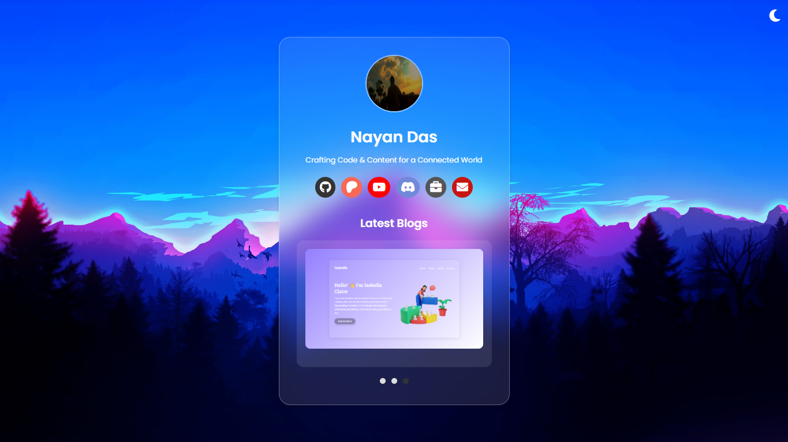

# 🔗 Link in Bio | Nayan Das

Hey fam! 👋 Welcome to the ultimate vibe check of the century — my **Link in Bio** project! 🎉 This is where aesthetics meet functionality. Let's dive into this masterpiece of modern web magic. 🚀

## 🎨 How It Looks



Check out the live demo: [Live Demo](https://socialportal.nayanchandradas.com)

Gagging for this design? It's pure vibes. 🌟

[](https://patreon.com/NayanDas69)
[](https://github.com/nayandas69/link-in-bio/stargazers)
[](https://github.com/nayandas69/link-in-bio/network/members)
[](https://github.com/nayandas69/link-in-bio/blob/main/LICENSE)
[](https://github.com/nayandas69/link-in-bio/commits)
[](https://github.com/nayandas69/link-in-bio)
[](https://nayanchandradas.com)
[](https://github.com/nayandas69/link-in-bio/deployments)
[](https://github.com/nayandas69/link-in-bio)
---

## ✨ What’s This About?

This bad boi is a slick, responsive, and hella interactive "link in bio" page. It’s like your one-stop shop to showcase your brand, social links, and latest blog bangers — all wrapped up in vibes so fresh, it’ll make you say, "OMG, slay!" 😍

---

## 💾 Features You’ll Stan:

- **Minimalist Aesthetics**: Serving glassmorphism realness for that frosted, dreamy look. ✨
- **Dark Mode**: For when you’re feelin’ those late-night vibes. 🌙
- **Interactive Carousel**: Swipe through the latest blogs like a pro. 🖱️
- **Responsive Design**: Works perf on mobile, tablet, or desktop. 🔧
- **Hover Effects**: Hover = extra swag. 💅
- **Smooth Scroll**: Scrolling this page feels smoother than a buttered pancake. 🥞
- **Auto Carousel**: Blogs that slide on their own? Yes, please! 😎

---

## 🚀 Tech Stack

This project’s got the goods:

- **HTML5**: Building blocks of the web, duh.
- **CSS3**: Styled to the max with flexbox, animations, and custom vibes.
- **JavaScript (ES6)**: Making the magic happen with DOM manipulation and event listeners.
- **FontAwesome**: For those spicy icons.

---

## 🔧 How to Run This Baddie

1. Clone it like a pro:
   ```bash
   git clone https://github.com/nayandas69/link-in-bio.git
   ```
2. Open the `index.html` in your browser.
3. Bask in the glory of your new favorite project. 🙌

---

## 🌈 Customizing This Baddie

- Wanna switch out your links? Check the `<div class="social-links">` in `index.html` and tweak it with your own deets. 💼
- Update the carousel content in `index.js` under the `blogs` array. 🖌️
- Need a color remix? Slide into `index.css` for some palette magic. 🎨

---

## 🤝 Let’s Collab

Got ideas to make this even more iconic? Submit a pull request or slide into my [email](mailto:nayanchandradas@hotmail.com). Don’t be shy! ✉️

---

## 🖤 Credits

Made with caffeine, dreams, and pure ✨ energy ✨ by **Nayan Das**.

---

## 📲 Connect With Me

- GitHub: [@nayandas69](https://github.com/nayandas69)
- Patreon: [@NayanDas69](https://patreon.com/NayanDas69)
- YouTube: [dasnayan69](https://youtube.com/@dasnayan69)
- Discord: [Hangout Server](https://discord.gg/skHyssu)
- Website: [nayanchandradas.com](https://nayanchandradas.com)

---

## ⭐ Pro Tip

If you like this project, don’t be gatekeepy — drop a star on GitHub. ⭐ That’s the to say, “I’m obsessed.”
